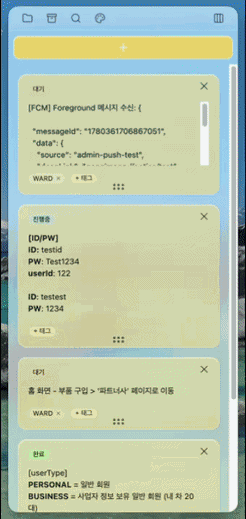
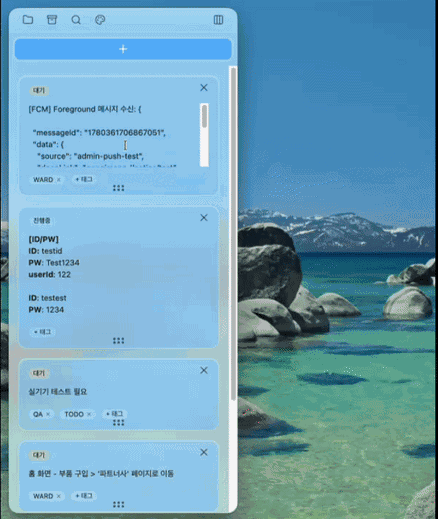

# momomo — macOS 플로팅 메모 앱

<p align="center">
  
</p>

<h2 align="center">
  <code>모</code>든 메<code>모</code>를 <code>모</code>찌게!
</h2>

<p align="center">
커스텀 컬러 테마로 멋있게 메모하고,
</p>

<p align="center">
폴더별 메모 생성, 태그 및 상태 기능으로 모든 메모 정리하기
</p>

<p align="center">
전체 화면 모드에서도 떠 있는 플로팅 메모 앱, 모모모!
</p>

## Preview

<p align="center">
  
  
</p>


## Installation

| 순서 | 작업 |
| --- | --- |
| 1 | **[Releases](https://github.com/thecheeziest/momomo/releases/latest)** 페이지에서 `.dmg` 파일 다운로드 |
| 2 | `.dmg` 파일 더블 클릭, `momomo.app`을 `Applications` 폴더로 드래그 |
| 3 | 터미널에 하단 `xattr -cr /Applications/momomo.app` 붙여넣기 |
| 4 | `Applications` 폴더 또는 Spotlight에서 momomo 실행 |

```bash
xattr -cr /Applications/momomo.app
```

> momomo는 미서명 앱이라 최초 실행 또는 업데이트 후 `xattr` 명령어가 필요합니다


## How to Use

- 실행 시 트레이(메뉴바)에 아이콘이 표시됩니다
- Dock에 아이콘이 뜨는 앱이 아니기 때문에 트레이 아이콘으로 조작합니다
- `Cmd+Shift+M`으로 앱을 보이게 하거나 숨길 수 있습니다
- 트레이 아이콘 클릭 또는 앱에서 `우 클릭` 후 **가이드**를 누르면 자세한 설명을 볼 수 있습니다
- 트레이에서 `Cmd`를 누른 채 아이콘 위치를 옮겨 두면 편리합니다 `(다른 앱 아이콘에 밀리지 않게 방지)`


## Updating

| 순서 | 작업 |
| --- | --- |
| 1 | 트레이 메뉴에서 **업데이트 확인** 클릭 |
| 2 | 새 버전이 있으면 새 `.dmg` 파일 다운로드 |
| 3 | `.dmg` 더블 클릭, `momomo.app`을 `Applications` 폴더로 드래그 |
| 4 | "동일한 항목이 있습니다" 다이얼로그에서 **바꾸기(Replace)** 선택 |
| 5 | 터미널에 `xattr -cr /Applications/momomo.app` 다시 실행 |

> 기존 `momomo.app`은 미리 삭제할 필요 없이 바꾸기만 하면 앱만 교체되고 메모 데이터(`~/Library/Application Support/momomo`)는 그대로 유지됩니다
>
> ⚠️ AppCleaner, CleanMyMac 같은 정리 앱으로 지우면 메모 데이터까지 함께 삭제됩니다 — 지울 땐 Finder에서 `momomo.app`만 휴지통으로
